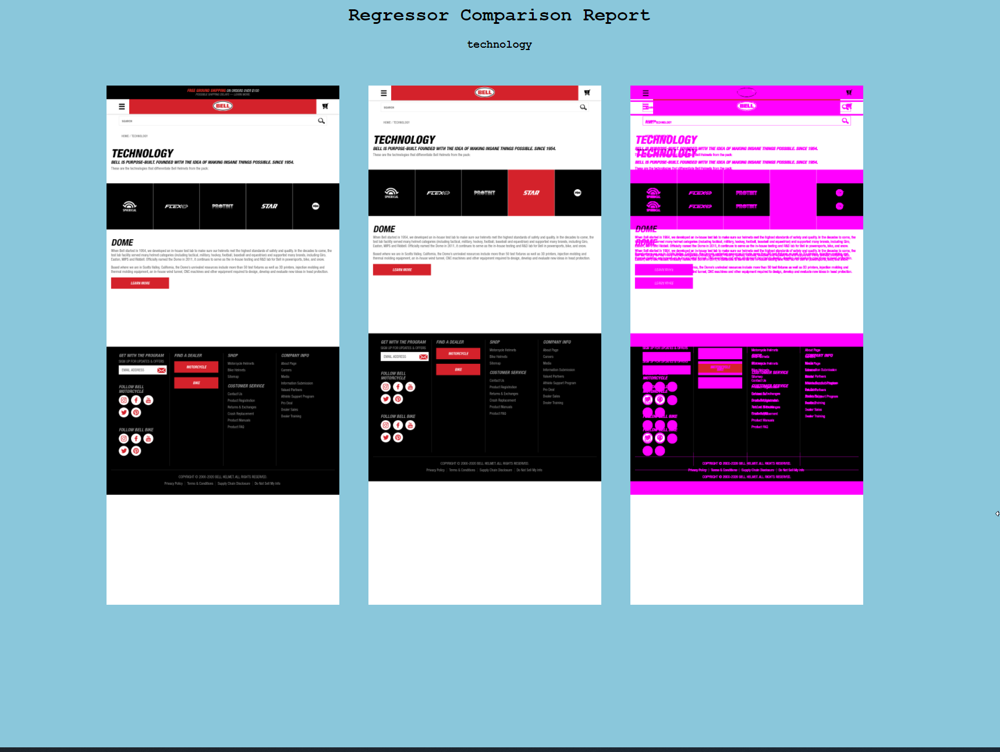

# Regressor

Regressor is a high performance visual regression tool to catch UI regressions. 



## Inspiration

Regressor takes inspiration from existing projects such as [Wraith](https://github.com/BBC-News/wraith) and [BackstopJs](https://github.com/garris/BackstopJS).

I have found visual regression testing to be one of the most effective ways to catch regressions. It's a great tool to have in your pipeline, but the current solutions on the market were missing one key component we felt was essential for a great developer experience... performance!

With the correct set up you can expect 40 comparisons running under a minute.


## Concept

The idea behind visual regression is essentially image comparison over time.

As you make changes to your site Regressor will take new images.

As you make changes to your site Regressor will take new images of your site

Regressor will then compare the latest images against the baseline images.

If there are differences the build fails and a report will be generated.
This gives you the opportunity to check the differences are expected.

If they are expected, update the baseline images

## Setup

In order to get the most out of Regressor we recommend 

  - Using the [selenium images from docker hub](https://hub.docker.com/u/selenium/) for consistent repeatable state 
  - Cloud storage (currently supporting Amazon S3)

To install the package:

#### `git clone`

```bash
cd ~
git clone https://github.com/bell-apps/regressor.git
cd regressor
npm install -g
regressor
```


Example config to run Regressor:

```
{
    "gridUrl": "http://selenium-grid:4444/wd/hub",
    "baseline": "./baseline",
    "latest": "./latest",
    "generatedDiffs": "./generatedDiffs",
    "report": "./reports",
    "remoteBucketName": "regressor-example",
    "remoteRegion": "us-west-1",
    "limitAmountOfParallelScenarios": 10, // if you are killing your selenium grid use this to batch up scenarios
    "onBeforeSuiteScript": "./scripts/login.js", // run a script before the entire suite (this script takes no parameters)
    "scenarios": [
      {
        "url": "http://www.bellhelmets.com/",
        "label": "homepage",
        "cropToSelector": ".flickity-slider", // crop the screenshot to a specific selector
        "removeElements": [".header-banner"],   // remove elements that are not static on refresh such as adverts
        "hideElements": [".is-delayedImage"] // hide elements that are not static on refresh such as adverts
        "viewports": [{"height": 2400, "width": 1024, "label": "large"}],
        "cookies": [
          {
            "name": "cookie_name",
            "value": "cookie_value"
          }
        ],
        "waitForElement": ["footer"],
        "waitForIFrameElement": {
          "frame": ".iframe", // the id of the iframe that you would like to change to.
          "element": ".element-in-iframe" // the element in the iframe that you would like to wait for.
        }
        "onReadyScript": './scripts/clickSelector.js',
        "wait": 2000 // implicitly wait before taking a snap
      }
    ]
  }
```

## Using S3 Storage for images

In order to use the S3 Storage capabilities you will need to export some aws credentials:

```
export AWS_SECRET_ACCESS_KEY=secretkey
export AWS_ACCESS_KEY_ID=keyid
```

Create an S3 bucket to store your images. 
Make sure to configure the bucket policy to allow viewing of objects.

## on Ready Script

For scenarios where you need to interact with the page before taking a screenshot, a script can be run which has the [selenium-webdriver](https://github.com/SeleniumHQ/selenium/wiki/WebDriverJs) driver and By exposed. 

Example script:

```
async function clickElement (browser, By) {
    await browser.wait(until.elementIsVisible(browser.findElement(By.css(utils.getFirstName()))), 10000);
    await browser.findElement(By.id("firstName")).sendKeys("Warren");
    await browser.findElement(By.css(".dob-day-option-field")).sendKeys("10");
};
module.exports = clickElement;
```

## on Before Suite Script

In cases where you need to run a script once, before the entire suite is launched (e.g. setting up global objects or setting up external services), pass the path of the script into `onBeforeSuiteScript` in the config file.

Unlike the onReady and onBefore script options, onBeforeSuite script does not have a driver passed to it as an argument. Any external dependencies will need to be set up independently inside the script. However, the script does provide access to the config, so that you can read/modify values dynamically if needed.

## Mobile Emulator

For scenarios where you need to use a mobile emulator, pass in the device name to the property `mobileDeviceName` on your config. Note that at the moment, this will only work with the chrome browser.

## Chrome Custom Options

For scenarios where you would like to add chrome custom options for example like different user-agent etc. pass the whole json configuration to the property `chromeCustomCapabilites` on your config. Note this will only work with the chrome browser.
```
  "chromeCustomCapabilities": {
    "mobileEmulation": {
      "deviceMetrics": { "width": 360, "height": 1600, "pixelRatio": 3.0 },
      "userAgent": "Mozilla/5.0 (Linux; Android 4.2.1; en-us; Nexus 5 Build/JOP40D) AppleWebKit/535.19 (KHTML, like Gecko) Chrome/18.0.1025.166 Mobile Safari/535.19"
    },
    "args": ["incognito"]
  }
```

## Running

### Supported Browsers: Firefox | Chrome

Take the latest screenshots for comparison:

`regressor snap --browser chrome --config config.json --remote --subfolder folder`

Set your latest screenshots as the baselines for future comparisons:

`regressor update-baseline --browser chrome --config config.json --remote`

Run the comparison between baseline and latest:

`regressor compare --browser chrome --config config.json --remote --subfolder folder`

Run a single scenario based on label name:

`regressor snap --browser chrome --config config.json --remote --run "scenarioName"`

## Visual Regression Tips and Tricks

To make your visual regression tests as robust as possible there are a few points to consider.

  - Data: Wherever you run Regressor you need to have complete ownership of data. Along with the ability to refresh the data back to a consistent state.
  - Dynamic elements: elements such as ads, videos, anything that moves should be removed using the `removeElements` or `hideElements` array.
      - `hideElements` - sets the opacity of the element to 0 and will not affect the positioning of other elements on the page.
      - `removeElements` - hard deletes the element from the Dom and may affect the positioning of other elements.
    You want your page under test to be static.
  - The application under test: Regressor is really effective when loading a page and screenshotting. You start to lose that benefit when you perform complicated setup journeys such as going through a checkout. Although possible with `onReadyScript` this should only be used for cases such as closing a cookie message. 
  - The selenium grid: We recommend using the container versions of selenium available from dockerhub. This ensures repeatable consistent state across test runs.
  
## Running Regressor on specific branch

Running Regressor on branches will enable you to catch issues sooner. To do this you can specify the `--branch` parameter, which will create a subdirectory for your branch, allowing you to test independently of other branches.

*Note: this option creates extra directories containing screenshots on your S3 bucket, so it is recommended to set up a lifecycle policy to delete these when you are done with them.*

Take the latest screenshots for comparison on a specific branch:

`regressor snap --browser chrome --config config.json --remote --branch branchName`

Run the comparison between baseline and latest on a specific branch:

`regressor compare --browser chrome --config config.json --remote --branch branchName`

In this case `snap` will create latest folder in specific `branch` on S3 bucket and `compare` will compare results on this branch and compare it will baseline. Report will be saved in branch folder.
  
  
## Limitations 

As of yet Regressor does not support switching contexts to iFrames
  
## Running All Regressor Tests

Regressor comes packaged up with a comprehensive set of tests adhering to the test pyramid to give a high level of confidence that the application is working as expected.

### Unit & Integration tests

`yarn test`


### End to End Tests

Inside the e2eTest folder there are a number of scenarios covering Regressor end to end.

I use Docker to package Regressor and then Docker Compose to spin up dependencies such as a Selenium Grid and NGINX to host a test website (/testSite) for Regressor to interact with.

To run the e2e tests run 

`yarn test:e2e:build`

`yarn test:e2e:run`
  
## Contributing

[To contribute please checkout CONTRIBUTING](./CONTRIBUTING.md)
